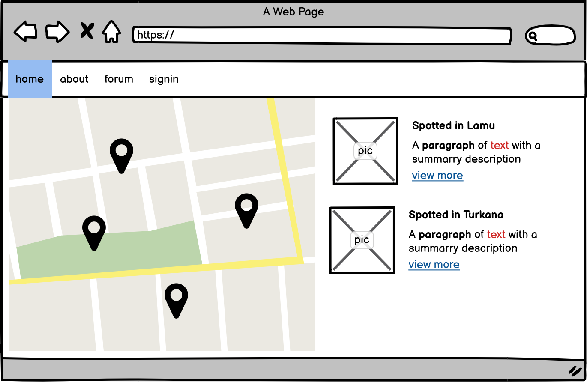

# Project Desctiption

The task is to make a virtual repository of animal disease symptoms observed in different areas. 

We will also intergrate an API to get more info about each symptom. This includes.

 * A picture or more of the animal affected
 * A descritpion of the symptoms
 * Location of the animal with symptoms
 * Type Animal affected

## Part 1 - Frontend

Here you are going to make the front-end part for displaying and adding data to the virtual repository

### UI and features

_Example UI with modern web browser._

The UI should be responsive design and work with different screen sizes. You don't need to support legacy browsers, so UI needs to work only on modern desktop and mobile browsers.

#### Requirements

* A map area to show a topographic view of symptoms reported
* A simple navigation bar to navigate to other pages
* A sidebar with a list of symptoms currently visible on the map 
* A detail view of a symptom, its info and comments 
* Login and registration pages
